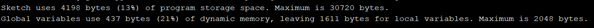
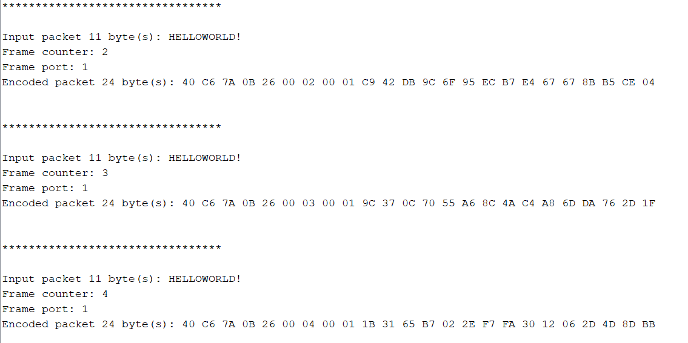
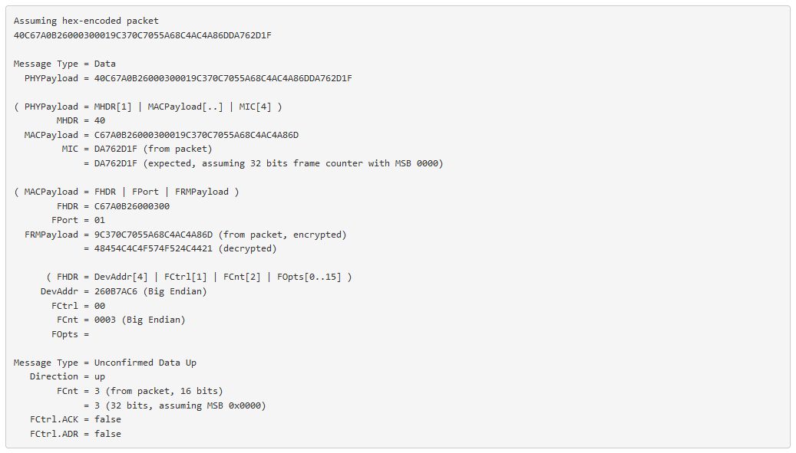
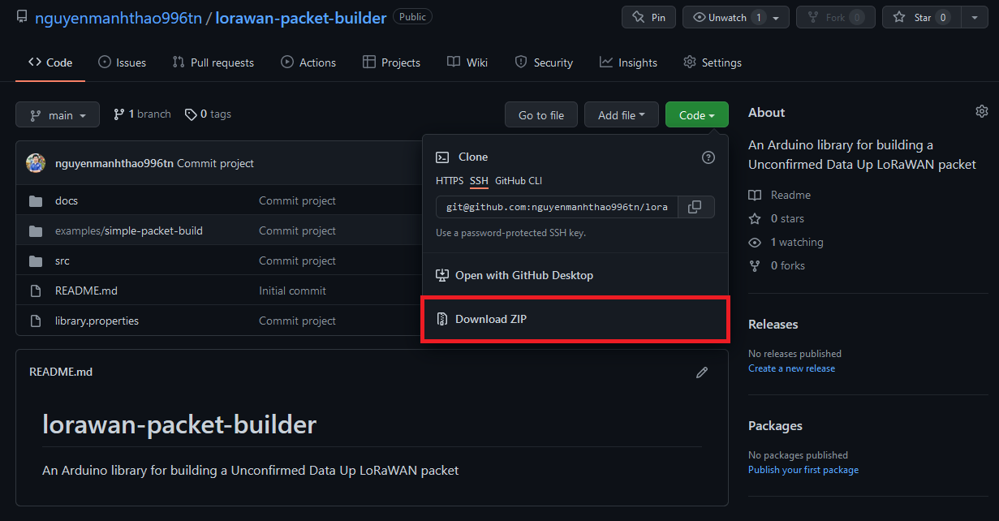
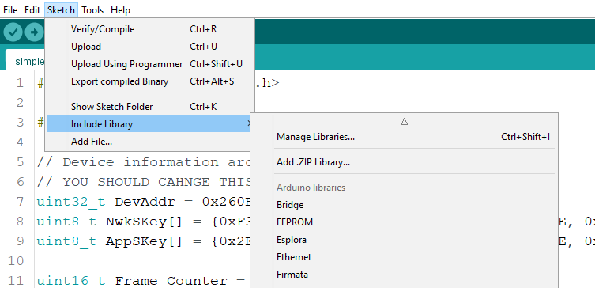
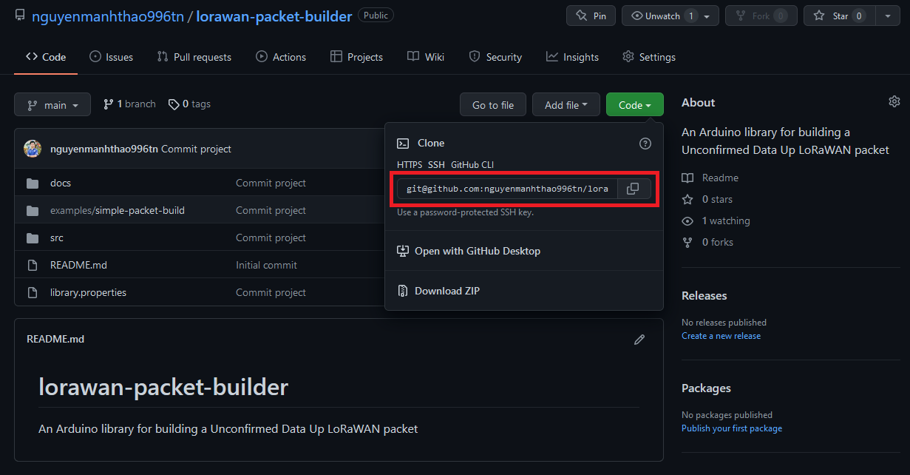

# LoRaWAN Packet Builder
An Arduino library for building a <b>Unconfirmed Data Up</b> LoRaWAN packet for limited resource MCU.

This source code intent for quick testing on LoRaWAN communication only.

MCU Resource requirements (<i>Results built on <b>Arduino Pro Mini (ATMEGA328P - 32kB Flash | 2 kB RAM)</b></i>


Example output


Decode the above example output


<u>Decoding website</u>: [https://lorawan-packet-decoder-0ta6puiniaut.runkit.sh](https://lorawan-packet-decoder-0ta6puiniaut.runkit.sh)


For anyone prefer copy & paste
```
https://lorawan-packet-decoder-0ta6puiniaut.runkit.sh
```
Decoding backend repository:
* [anthonykirby/lora-packet](https://github.com/anthonykirby/lora-packet)

# Installation
You can either install this library by using Arduino .ZIP Library import feature or cloning directly into your Arduino Library folder.

## Method 1: Use Arduino .ZIP Library import feature (Recommended)

* <b><u>Step 1</b></u>: Download this reposistory as a zip file


* <b><u>Step 2</b></u>: In Arduino IDE, select <b>Sketch -> Include Library -> Add .ZIP Library..</b> Browse to the zip archive downloaded in Step 1 and import.


For further instructions, refer to [this guide](https://docs.arduino.cc/software/ide-v1/tutorials/installing-libraries) from Arduino CC.

## Method 2: Clone this repository directly into your Arduino Library folder

<b><u>Step 1</b></u>: Open Git Bash and navigate to the Arduino Library folder. Default folder on Windows:
```
C:\Users\<username>\Documents\Arduino\libraries
```

<b><u>Step 2</b></u>: Copy the reposistory clone URL and clone with this command
```
git clone git@github.com:nguyenmanhthao996tn/lorawan-packet-builder.git
```


# Credit
This source code is fetched and simplified from Arduino-LMIC repository. Consider to give the origin repo a star if you find this useful. Thanks!
* [mcci-catena/arduino-lmic](https://github.com/mcci-catena/arduino-lmic)
* [anthonykirby/lora-packet](https://github.com/anthonykirby/lora-packet)
